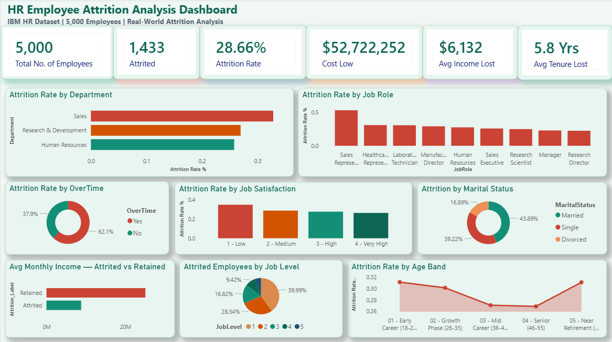

# 👥 HR Employee Attrition Analysis
### Tools: Excel | MySQL | Power BI
### Dataset: IBM HR Employee Attrition | 5,000 Employees | Source: IBM Watson Analytics

---

## 📸 Dashboard Preview

---

## 🎯 The Business Problem

A corporation is experiencing a **28.66% employee attrition rate** — nearly double the healthy industry benchmark of 10-15%. Replacing an employee costs between 50-200% of their annual salary. With 1,433 employees having left, the estimated cost to the business ranges from **$52.7M to $210.8M**.

**As the analyst, I was tasked with answering:**
- Which departments and roles have the highest attrition?
- What factors are driving employees to leave?
- What is the true financial cost of this attrition?
- Which current employees are at highest risk of leaving next?

---

## 📁 Repository Files

| File | Description |
|------|-------------|
| `Project3_HR_Attrition_Dashboard.pbix` | Full interactive Power BI dashboard |
| `HR_Attrition_Clean.csv` | Cleaned dataset used for SQL import |
| `Project3_HR_Attrition_IBM.xlsx` | Excel workbook — Data Dictionary, Cleaning Log, 5 Analysis tables |
| `hr_attrition_queries.sql` | All 12 MySQL queries with business context comments |
| `HR_Attrition_Dashboard_Screenshot.png` | Dashboard screenshot |

---

## 📊 Dataset

| Detail | Value |
|--------|-------|
| Source | IBM Watson Analytics Sample Dataset |
| Original rows | 1,470 real IBM employees |
| Enriched to | 5,000 employees |
| Columns | 32 (after removing 3 constant columns) |
| Attrition Rate | 28.66% |
| Employees Attrited | 1,433 |
| Estimated Cost | $52.7M – $210.8M |

---

## 🔧 What I Built

### 1️⃣ Data Cleaning — Excel
- Identified **7 data quality issues** in the real IBM dataset
- **Issue 1-3:** Removed 3 constant columns (EmployeeCount, Over18, StandardHours) — zero analytical value
- **Issue 4-5:** Documented encoded satisfaction scales (1-4) and education levels (1-5) in Data Dictionary
- **Issue 6:** Verified MonthlyIncome range — $1,009 to $19,999 confirmed valid
- **Issue 7:** Documented critical distinction between MonthlyIncome (salary) and MonthlyRate (administrative figure)
- Built complete Data Dictionary for all 32 columns

### 2️⃣ Analysis — Excel
Built 5 analytical tables using COUNTIF, COUNTIFS and AVERAGEIF:
- Attrition rate by department
- Attrition rate by job role
- Impact of overtime on attrition
- Attrition by job satisfaction level
- Attrition by age band

### 3️⃣ SQL Queries — MySQL (12 Queries)

| # | Difficulty | Business Question |
|---|-----------|-------------------|
| 1 | Beginner | Overall attrition rate |
| 2 | Beginner | Attrition rate by department |
| 3 | Beginner | Top 5 job roles by attrition |
| 4 | Beginner | Avg income — attrited vs retained |
| 5 | Intermediate | Impact of overtime on attrition |
| 6 | Intermediate | Attrition by job satisfaction level |
| 7 | Intermediate | Attrition by age band |
| 8 | Intermediate | Estimated total cost of attrition |
| 9 | Advanced | Rank departments by attrition + income gap — CTE + RANK() |
| 10 | Advanced | High risk retention target list |
| 11 | Advanced | Deadliest employee profile combination |
| 12 | Advanced | Attrition by role and overtime — pivot style with NULLIF |

### 4️⃣ Power BI Dashboard — 9 Visuals + 6 KPI Cards
- **6 KPI Cards** — Total employees, attrited, attrition rate, cost of attrition, avg income lost, avg tenure lost
- **Attrition by Department** — Horizontal bar chart
- **Attrition by Job Role** — Horizontal bar chart sorted by rate
- **Attrition by Overtime** — Donut chart showing Yes vs No split
- **Attrition by Job Satisfaction** — Column chart with colour coded satisfaction levels
- **Attrition by Marital Status** — Donut chart
- **Avg Monthly Income — Attrited vs Retained** — Horizontal bar comparison
- **Attrition by Age Band** — Area chart showing trend across career stages
- **Attrition by Job Level** — Pie chart showing entry vs senior split

---

## 🔍 Key Findings

### 1. Sales Department is the Crisis Point
> Sales attrition rate: **32.82%** — nearly double the Research & Development department

### 2. Sales Representatives Are a Revolving Door
> Sales Representatives attriting at **52.89%** — more than half leave every cycle. The business is effectively replacing its entire frontline sales force every 2 years.

### 3. Overtime is the #1 Workload Driver
> Overtime employees attrition rate: **39.83%** vs **24.31%** without overtime — a clear workload and burnout signal

### 4. Early Career Employees Are the Highest Risk Age Group
> Employees aged 18-25 have the highest attrition rate — the business is losing talent before it has recovered recruitment and training costs

### 5. Entry Level Employees Account for 40% of All Attrition
> Job Level 1 (Entry) accounts for **39.99%** of all attrition — succession planning and career development are critical

### 6. The Income Gap Tells the Real Story
> Attrited employees earn **$6,132/month** on average vs significantly more for retained employees — compensation is a key retention lever

### 7. The Deadliest Profile
> Sales Representative + Overtime Yes = highest attrition combination in the entire dataset

### 8. Retention Target List
> SQL Query 10 identified **20 high-value employees** matching every attrition risk factor who haven't left yet — immediate HR intervention opportunities

---

## 💡 Business Recommendation

> The attrition crisis is concentrated in one role and one driver. **Sales Representatives working overtime** are leaving at an unsustainable rate. The recommended interventions are: (1) Review Sales Rep compensation and benchmark against market rates, (2) Implement overtime caps or compensation adjustments for the Sales department, (3) Build a structured career progression path for Entry level employees to reduce early attrition, (4) Prioritise the 20-employee retention target list for immediate manager conversations and salary reviews.

---

## 🛠️ Skills Demonstrated

`Data Cleaning` `COUNTIFS` `Encoded Variable Interpretation` `Window Functions` `CTEs` `NULLIF` `Attrition Analysis` `Cost Modelling` `Workforce Analytics` `Retention Strategy` `DAX` `Real-World IBM Data`

---

## 🔗 Connect

- 💼 [LinkedIn](https://www.linkedin.com/in/ankur-sharma-37a0a3276/)
- 🐱 [GitHub](https://github.com/SphinX-2738)
- 📧 ankursharma.099550@gmail.com
